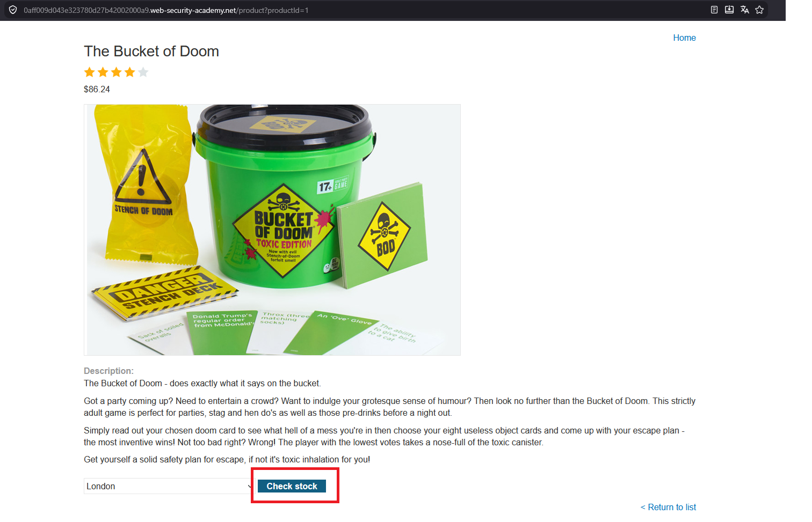
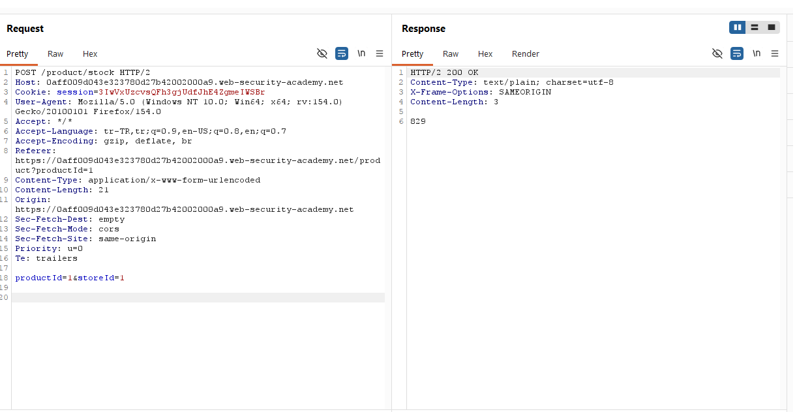
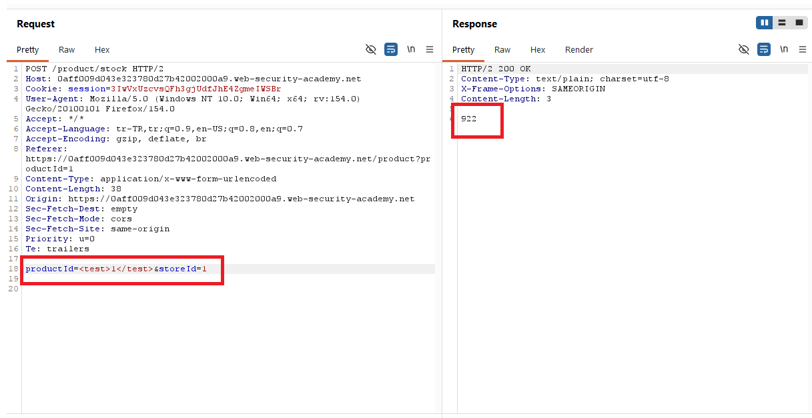
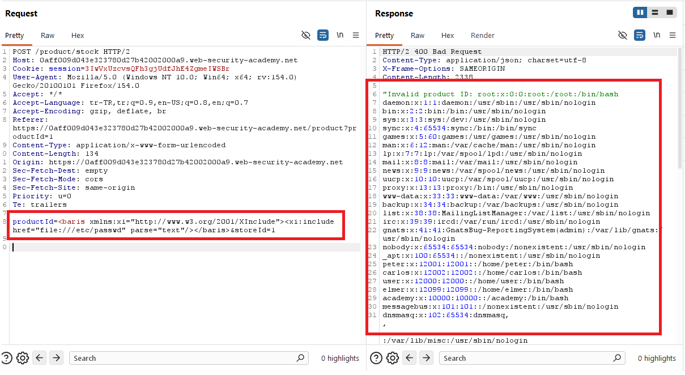
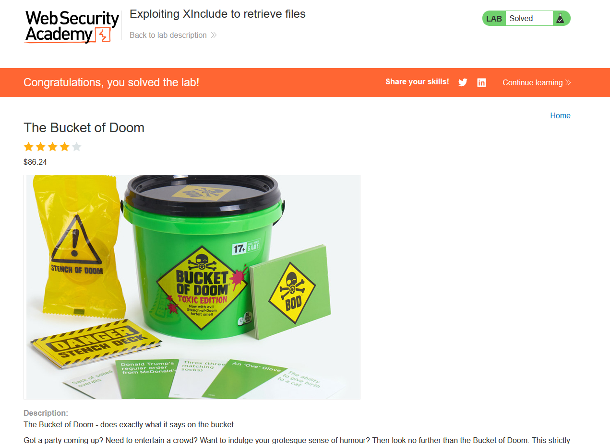

# Exploiting XInclude to retrieve files

## 1. Lab Bilgisi

**Difficulty:** Practitioner

## 2. Vulnerability Özeti

Bu labda stok kontrol fonksiyonu XML body ile değil, `application/x-www-form-urlencoded` formatında `productId` ve `storeId` parametreleriyle çalışıyordu. Doğrudan `DOCTYPE` tanımı eklenemediği için klasik external entity yöntemi yerine XInclude kullanıldı. Sunucu tarafında bu parametreler XML dokümanına yerleştirildiği için `productId` değerine eklenen `xi:include` etiketi işlendi ve `/etc/passwd` dosyası response içinde döndü.

## 3. Kullanılan Payload

```xml
<baris xmlns:xi="http://www.w3.org/2001/XInclude">
  <xi:include href="file:///etc/passwd" parse="text"/>
</baris>
```

URL encoded istek body:

```http
productId=<baris xmlns:xi="http://www.w3.org/2001/XInclude"><xi:include href="file:///etc/passwd" parse="text"/></baris>&storeId=1
```

## 4. Exploitation Steps

1. İlk olarak ürün detay sayfasında `Check stock` fonksiyonunu tespit ettim.



2. `Check stock` isteğini Burp Suite ile yakaladım. Önceki XXE lablarından farklı olarak isteğin XML body ile değil, `application/x-www-form-urlencoded` formatında gönderildiğini gördüm.



3. Body içinde `productId=1&storeId=1` parametreleri bulunuyordu. Parametrenin sunucu tarafında XML olarak işlenip işlenmediğini anlamak için önce `productId` değerine basit bir XML etiketi yerleştirdim.

```xml
<test>1</test>
```



4. Response içinde normal stok değeri döndüğü için `productId` parametresinin XML parse sürecine dahil edildiğini doğruladım. Bu durumda XML dokümanının tamamını kontrol edemediğim için `DOCTYPE` eklemek yerine `productId` parametresine XInclude payload'ı yerleştirdim.

```xml
<baris xmlns:xi="http://www.w3.org/2001/XInclude">
  <xi:include href="file:///etc/passwd" parse="text"/>
</baris>
```

5. Payload içinde `xi` namespace'i `http://www.w3.org/2001/XInclude` olarak tanımlandı. `href` değeri `/etc/passwd` dosyasını hedefleyecek şekilde `file:///etc/passwd` yapıldı ve dosyanın metin olarak dahil edilmesi için `parse="text"` kullanıldı.

6. İsteği gönderdiğimde uygulama `productId` değerini sunucu tarafındaki XML işlemine dahil etti. XML parser XInclude ifadesini işlediği için `/etc/passwd` dosyasının içeriği hata mesajı içinde response'a yansıdı.



7. Response içinde sistem kullanıcılarına ait `/etc/passwd` satırları görüntülendi. Bu çıktı XInclude enjeksiyonu ile sunucu tarafında dosya okunabildiğini doğruladı.

8. `/etc/passwd` içeriği response içinde döndükten sonra lab başarıyla çözüldü.



## 5. Impact

XInclude enjeksiyonu, saldırganın XML dokümanının tamamını kontrol edemediği durumlarda bile sunucu tarafında dosya okuma yapmasına imkan verebilir. Bu zafiyet sonucunda sistem dosyaları, uygulama konfigürasyonları, credential bilgileri veya sunucuda erişilebilir diğer hassas dosyalar açığa çıkabilir.

## 6. Remediation

XML parser üzerinde XInclude desteği gerekli değilse devre dışı bırakılmalıdır. Kullanıcıdan gelen veriler XML dokümanına doğrudan eklenmemeli, XML oluşturma işlemleri güvenli API'lerle yapılmalı ve kullanıcı girdileri uygun şekilde doğrulanmalıdır. Ayrıca external entity, external DTD ve dış kaynak çözümleme özellikleri kapatılmalı; parser güvenli işleme modunda çalıştırılmalıdır.
