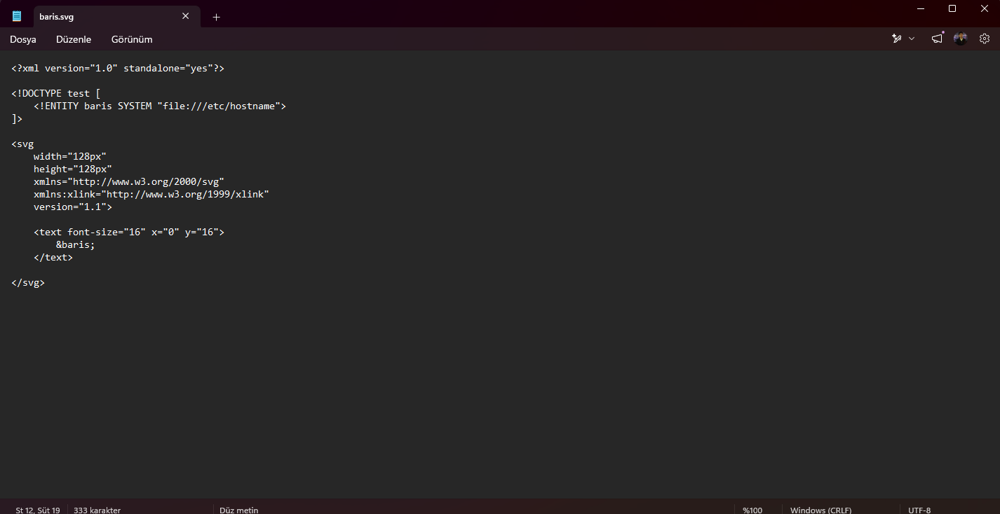
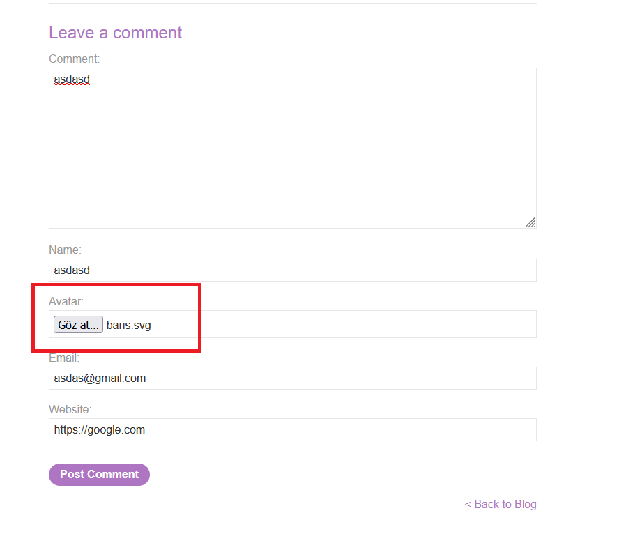
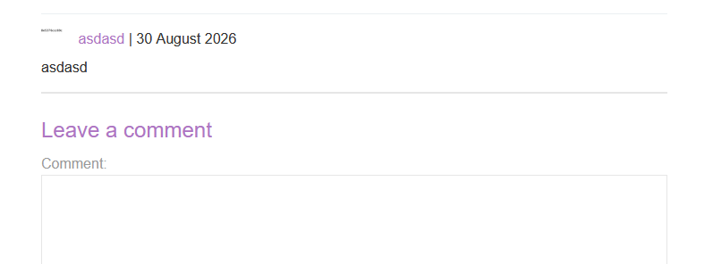
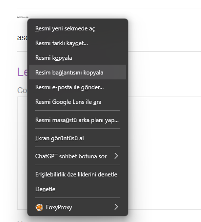
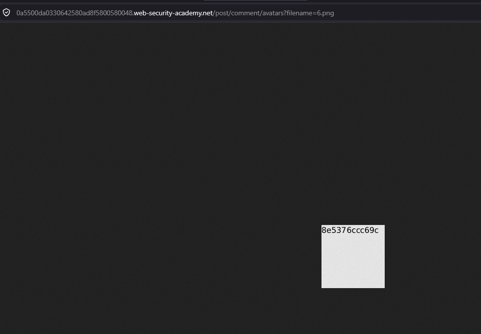
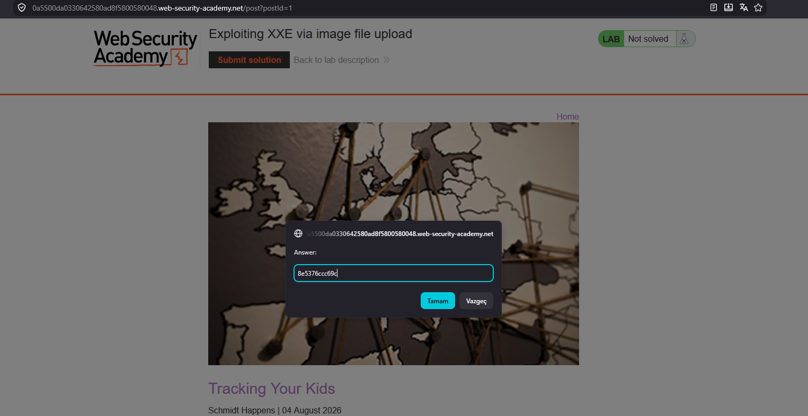
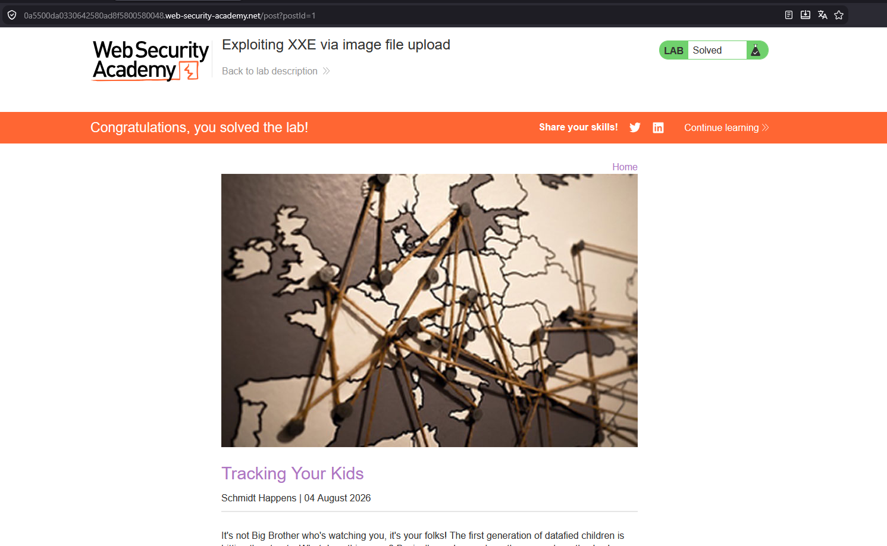

# Exploiting XXE via image file upload

## 1. Lab Bilgisi

**Difficulty:** Practitioner

## 2. Vulnerability Özeti

Bu labda yorum formundaki avatar yükleme fonksiyonu SVG dosyalarını kabul ediyordu. SVG dosyaları XML tabanlı olduğu için dosyanın içine external entity tanımı ekleyerek sunucu tarafındaki XML parser'ın yerel dosya okumasını tetikledim. Entity hedefini `file:///etc/hostname` olarak ayarladığımda hostname değeri yüklenen avatar görselinin içinde render edildi. Bu değeri labın submit solution alanına göndererek labı çözdüm.

## 3. Kullanılan Payload

```xml
<?xml version="1.0" standalone="yes"?>
<!DOCTYPE test [
  <!ENTITY baris SYSTEM "file:///etc/hostname">
]>

<svg
  width="128px"
  height="128px"
  xmlns="http://www.w3.org/2000/svg"
  xmlns:xlink="http://www.w3.org/1999/xlink"
  version="1.1">

  <text font-size="16" x="0" y="16">
    &baris;
  </text>
</svg>
```

## 4. Exploitation Steps

1. İlk olarak XXE payload içeren bir SVG dosyası hazırladım. `DOCTYPE` içinde `baris` isimli external entity tanımlandı ve bu entity `file:///etc/hostname` dosyasını hedefledi.



2. Blog post altındaki yorum formuna gittim. Yorum, isim, e-posta ve web sitesi alanlarını doldurduktan sonra avatar alanına hazırladığım `baris.svg` dosyasını yükledim.



3. Yorumu gönderdikten sonra uygulama avatarı yorumun yanında görüntüledi. SVG içindeki external entity sunucu tarafında işlendiği için avatar görselinde `/etc/hostname` içeriği render edildi.



4. Avatar görselinin dosya bağlantısını kopyaladım.



5. Avatar dosyasını yeni sekmede açtığımda hostname değeri görselin içinde net şekilde görüntülendi.



6. Elde ettiğim hostname değerini labın `Submit solution` alanına girdim.



7. Doğru hostname değeri gönderildikten sonra lab başarıyla çözüldü.



## 5. Impact

SVG gibi XML tabanlı dosyaların güvenli olmayan şekilde işlenmesi, dosya yükleme fonksiyonları üzerinden XXE zafiyetine yol açabilir. Saldırgan, sunucunun erişebildiği yerel dosyaları okuyabilir ve bu bilgileri görsel çıktısı, hata mesajı veya başka bir response kanalı üzerinden sızdırabilir. Bu durum hostname, konfigürasyon dosyaları, credential bilgileri veya uygulama secret'ları gibi hassas verilerin açığa çıkmasına neden olabilir.

## 6. Remediation

Kullanıcı tarafından yüklenen SVG dosyaları güvenli şekilde işlenmeli veya mümkünse tamamen engellenmelidir. XML tabanlı dosyalar parse edilirken `DOCTYPE`, external entity ve dış kaynak çözümleme özellikleri devre dışı bırakılmalıdır. Avatar gibi görsel yükleme alanlarında dosya içeriği doğrulanmalı, dosyalar yeniden encode edilerek güvenli bitmap formatlarına dönüştürülmeli ve yalnızca beklenen MIME type ile dosya uzantılarına izin verilmelidir.
